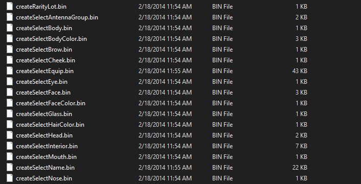

# Datasets
Datasets are a proprietary file format used to store definitions for various aspects of gameplay.

## In Denpa Men 3

- the datasets are in 21350000
- they are stored in zip files
- the extension is .bin

### Read more
- [monsterIDs](dataset/monsterIDs.md)

- [BodyColorData](dataset/BodyColorData.md)
