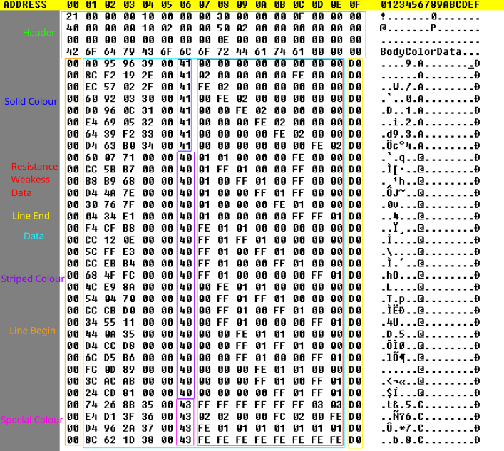

# BodyColorData
## Mapping
The following image is a labled map of the unedited data file for bodyColorData.bin, in The Denpa Men 3.
Each part of the file is segmented off into different identifiers for easier viewing.

## Formatting
### Header
The first 64 bytes are a standard header used by most datasets, including a label for the dataset as well as a byte indicating the length of each data segment.
### Body
The rest of the file contains the data of the file, sectioned into 16 byte long lines for each Body Color in the game. The first and last columns of bytes are thought to be indicators for line beginnings and endings respectively. The 5 bytes following the first byte serve an unknown purpose, but are notably different on each color. The following byte indicates whether the color is a solid color, a striped color, or a special color, using 0x41, 0x40, and 0x43 respectively. The next 8 bytes indicate each elemental resistance/weakness for the color. In order, the bytes represent the elements Fire, Ice, Wind, Earth, Electricity, Water, Light, and Dark. The elemental resistances/weaknesses are represented by a signed 8 bit integer, and range from the values 0x00-0x09 for resistance, and 0xFF-0xF6 for weakness, where 0x00 is no effect, 0x09 is +9, and 0xF6 is -9.

## Reference
Body colors are stored in the following order:
1) Black
2) Red
3) Cyan
4) Green
5) Orange
6) Yellow
7) Blue
8) White
9) Red-Cyan
10) Red-Green
11) Red-Orange
12) Red-Yellow
13) Red-Blue
14) Red-White
15) Cyan-Green
16) Cyan-Orange
17) Cyan-Yellow
18) Cyan-Blue
19) Cyan-White
20) Green-Orange
21) Green-Yellow
22) Green-Blue
23) Green-White
24) Orange-Yellow
25) Orange-Blue
26) Orange-White
27) Yellow-Blue
28) Yellow-White
29) Blue-White
30) Purple
31) Silver
32) Gold
33) Pink

## Speculation
It is worth nothing that the 5th byte of each row is marked as 0x00 for all striped colors, and increases from 0x2E-0x39 for all solid colors, starting at red and ending at black. In addition, the 6th byte of each row is always 0x00. It may be possible that status resistances are encoded within the 2nd, 3rd, and 4th bytes of each row.
